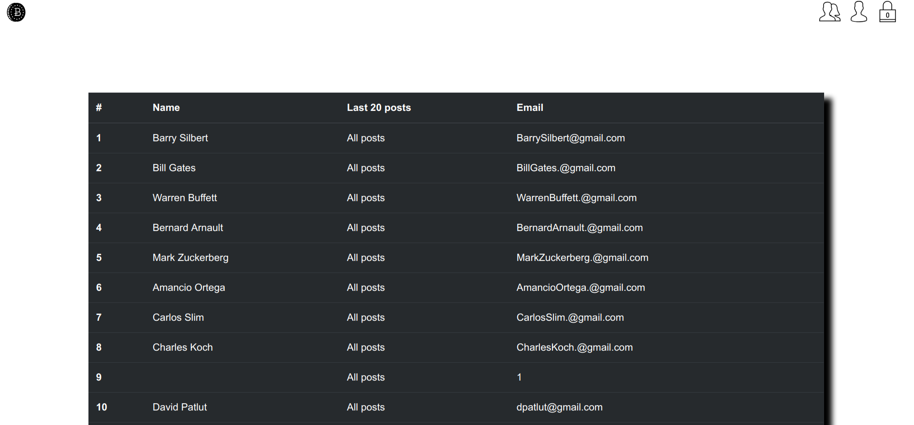

# Demo Log in: test@gmail.com password: 111111

##Fullstack Blog Application

Application allowes user creating, deleting and editing technology related notes, creating, as well as editing and deleting accounts.

 
 
 

#Built with:

Ruby
Sinatra
PostgreSQL
CSS/SASS
bootstrap

#Features:

Creating new accounts
Editing / Deleting accounts
Creating/Editing/Accesing/Deleting new articles - feature available only for the logged in user
Viewing all articles
Viewing all users and their articles
